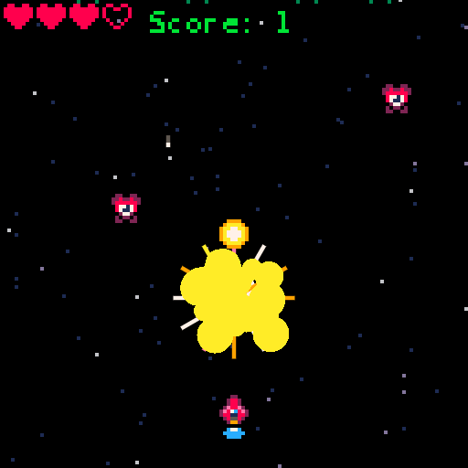

SHMUP TUTORIAL
===

This is a port of the [Lazy Devs](https://www.youtube.com/playlist?list=PLea8cjCua_P3Sfq4XJqNVbd1vsWnh7LZd)  Shmup tutorial from 
from [PICO-8](https://www.lexaloffle.com/pico-8.php) to [Love2d](https://love2d.org)

You can watch the videos in the following playlist

Lazy Devs [Youtube Playlist](https://www.youtube.com/playlist?list=PLea8cjCua_P3Sfq4XJqNVbd1vsWnh7LZd)

Requirements:
* Love2D
* LunaJson (install via LuaRocks)
* If editing in VS Code will want the Local Lua Debugger extension.