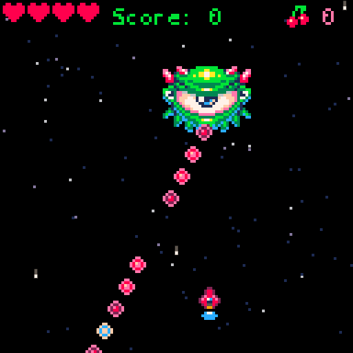

SHMUP TUTORIAL
===

This is a port of the [Lazy Devs](https://www.youtube.com/c/LazyDevs)  Shmup tutorial from 
from [PICO-8](https://www.lexaloffle.com/pico-8.php) to [Love2d](https://love2d.org)

You can watch the videos in the following playlist

Lazy Devs [Youtube Playlist](https://www.youtube.com/playlist?list=PLea8cjCua_P3Sfq4XJqNVbd1vsWnh7LZd)

Requirements:
* [Lua](lua.org)
* [Love2D](https://love2d.org/)
* [LunaJson](https://luarocks.org/modules/grafi/lunajson) (install via LuaRocks, or just copy what is inside the src folder into the project)
* [Bitstream Vera Mono](https://www.1001fonts.com/bitstream-vera-sans-mono-font.html) font. (May be swapped out for another).

Tools:
* [GIMP](gimp.org) for sprite work
* [Milky Tracker](https://milkytracker.org/) for music (sorry mine is so horrible)
* [JFXR](https://jfxr.frozenfractal.com/) for sound effects
* [Visual Studio Code](https://code.visualstudio.com/) for editing
* You will want the [Local Lua Debugger](https://marketplace.visualstudio.com/items?itemName=tomblind.local-lua-debugger-vscode) extension for Visual Studio Code.